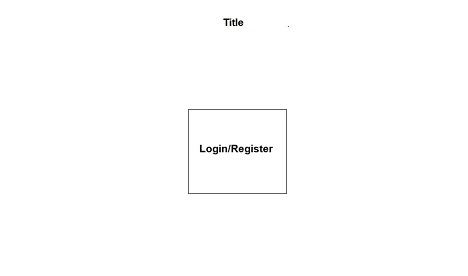
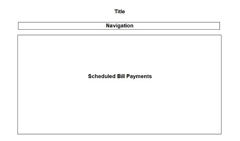
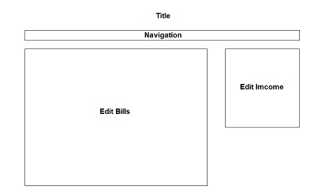
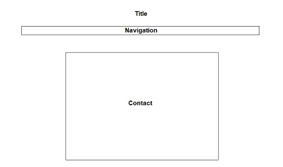
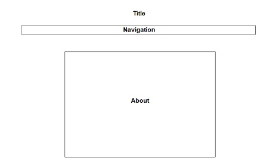
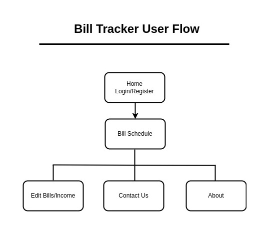

# Mike Guillory - Bill Tracker APP

---
## Definition Statement
---
I want to build an application that will enable the user to keep track of their bill payments and to see at-a-glance that they are living within their means. A majority of people in the US live [paycheck to paycheck](https://ir.lendingclub.com/news/news-details/2023/60-of-Americans-Now-Living-Paycheck-to-Paycheck-Down-from-64-a-Month-Ago/default.aspx#:~:text=Today's%20Paycheck%2Dto%2DPaycheck%20Landscape,percentage%20points%20from%20January%202022. ). This app will be far simpler to use than the many budgeting apps available, and in that way, people will be more inclined to actually make use of it.

---
## Definition of Audience
---
This app will be for anyone who wants to be sure that their bills are paid in an organized manner, especially those living paycheck to paycheck or close to it.

---
## Outline of content
---
- Home Page - Navigation Login/Register
- Payment Schedule - View payments scheduled by week, month or a number of months
- Bills/Income - Add, update, and delete bill and income information
- About - The purpose of the app
- Contact - Offer suggestions

---
## The purpose of my application
---
My app will automatically schedule the users' bills and allow them to see in advance what the situation is with their bills vs. their income.

---
## What business problem or real world problem am I going to be solving?
---
- Uncertainty about the user's financial situation
- Bills being overlooked or going unpaid for unexpected/unforeseeable reasons

---
## Color Palette
---
- #0B2447
- #19376D

---
## Images
---
None

---
## Fonts
---
Arial, Times New Roman, Helvetica

---
## Logos
---
None

---
## Navigation
---
- Home (Login/Register)
- Bill Schedule
- Edit Bills and Income
- About
- Contact Us

---
## User Story Map
---
[Bill Tracker Story Map](https://app.mural.co/t/savvyfs0717/m/savvyfs0717/1680999954159/0a9bfa46459c9841de5b73669e80eb1c35d457ad?sender=u8d38b5a735aaf1fc30710933)

---
## Research
---
https://www.timelybills.app/
- Like - It's fairly easy to navigate and to enter bill, income, and account information.
- Dislike - It doesn't display the information in the way that I want to see it.

https://www.youtube.com/watch?v=eTo16s_qrgI
- Like -
Pull down menu to mark bills Paid
Total paid and unpaid information
Notes section
Duplicate highlighting

- Dislike - While this does display the information in a manner similar to what I want to do, it does not include information about the amount of money left over each pay period.

My application will fall between the choices that I’ve seen online. It will not be a budgeting app, which means it will be less complicated to use and have less features, and it will not be an automated spreadsheet in that it will be less exact and provide more of an at-a-glance big-picture outlook.

It will be less exact because it will use estimated, anticipated, averages for income and the amount due for certain fluctuating bills, and it will be more big-picture because the user will enter information about their bills once, and the app will automatically create a schedule for whatever number of weeks or months the user selects.

Should the user choose to do so, the app could help a user to budget if they list certain expenditures like they would a bill. In any case, like all of the other options out there it will still help to ensure that bills are being paid on time.

---
## Wireframes
---
Home Page

---
## User Flow

---
## SWOT Analysis
---
### Strengths
- Less complicated to implement
- More automated
- More big-picture information at-a-glance

### Weakness
- Less features compared to budgeting apps
- Less exact
- Less information overall

### Opportunities
- This app falls between the two types of options currently available
- The number of people living paycheck to paycheck is not likely to improve much, if at all
- Rising inflation can make it more difficult for people to meet their obligations, spurring an urge for more certainty in their financial situation

### Threats
- Many competing Budgeting and Bill Tracking apps
- The hesitancy of some to face financial realities

---

